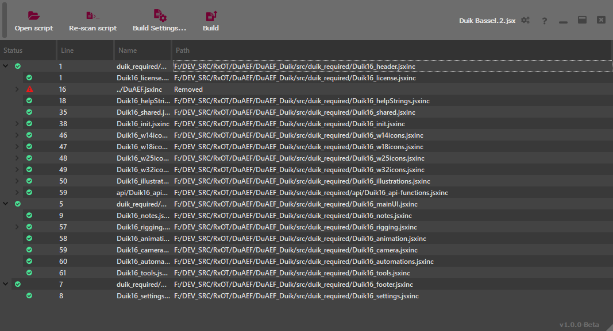

# Graphical User Interface

## Basic use

When loading a script in *DuBuilder*, it will detect all `#include` and `#includepaths` instructions and list the associated files. If the file cannot be found, a red warning icon is displayed. Just double-click on the corresponding line to set the path to the missing file, then click on the *Build* button to build your script.

## Default include paths

In the settings panel (top right *cogs* button), you can add some default include paths. *DuBuilder* will automatically search for missing *include files* in these folders.

The order is important: if a file with the same name is available in multiple include paths, *DuBuilder* will use the first one. You can re-order the paths by just dragging them.

## Building jsdoc

Click on the *Build Settings* button and on *Build JSDoc* to automatically build the documentation found in the script.

*DuBuilder* will ask for the location of the *JSDoc* configuration `.json` file you want to use to build the documentation. See the [JSDoc](http://jsdoc.app) website for more information.

!!! Note
    DuBuilder does not provide [JSDoc](http://jsdoc.app), you have to install it separately using [*node.js*](https://nodejs.org) and *npm*.